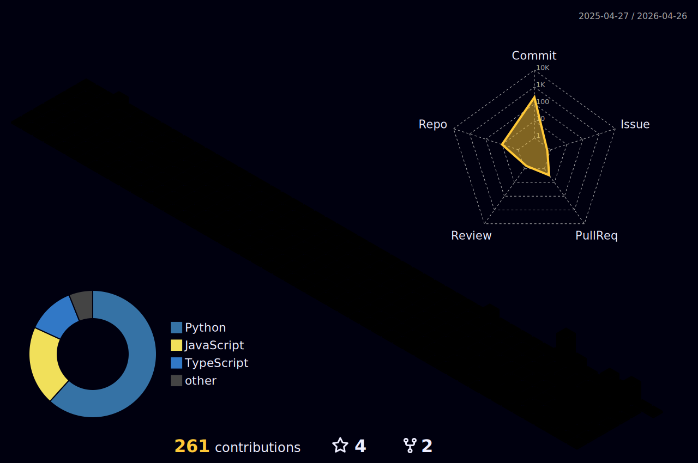

#  Hi there, I'm Ryan Qi! 

  

---
- 🎓 Studying **Mathematics @ University of Waterloo**.
- Creator of **[BlackSwan](https://github.com/Lushenwar/BlackSwan)**, an adversarial copilot for stress-testing code.
- Worked on **[Eco-Pulse](https://github.com/Lushenwar/Eco-Pulse)** to help map heat and coordinate planting relief.
- Passionate about **Full-Stack Development** and building tools that make a real-world impact.
- Always open to collaboration or an interesting chat about anything!
---
### Let's Connect
- 
- 
- 
---

  

<!-- Once the GitHub Action runs, your 3D graph will appear below -->

  

---

## 🛠️ Tech Stack

  
  
  
  

  
  
  
  

  
  
  
  

  
  
  

<!-- 
This profile was automatically generated and enhanced with 🚀 by Antigravity
-->
