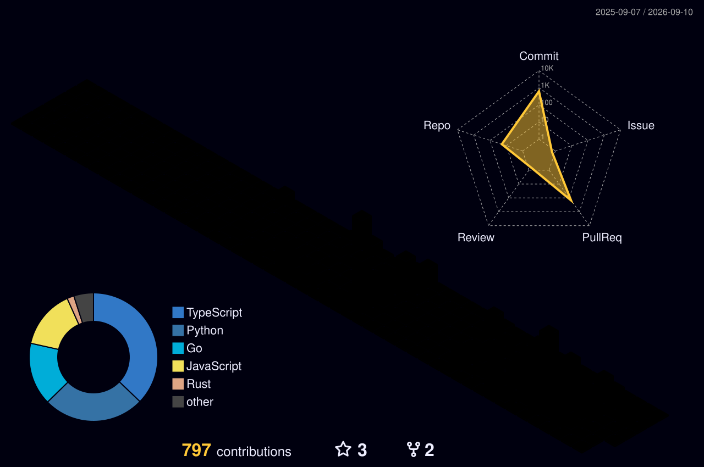

<!-- HEADER -->


<p align="center">
  
</p>

<p align="center">
  
</p>

<p align="center">
  
  
</p>

<p align="center">
  <a href="https://ryanqiportfolio.vercel.app/"></a>
  <a href="https://www.linkedin.com/in/ryan-qi/"></a>
  <a href="mailto:r28qi@uwaterloo.ca"></a>
  <a href="https://github.com/Lushenwar"></a>
</p>

<p align="center">
  
  
  
</p>

---

## About

I'm a Mathematics student at the **University of Waterloo** building software at the intersection of **full-stack product engineering** and **applied AI/ML**. I like shipping systems that survive contact with the real world — adversarial copilots that break code before users do, deep-learning pipelines serving predictions in real time, and geospatial tooling that turns raw data into decisions.

My work leans on a **product engineering mindset**: correctness, scale, and user impact over novelty for its own sake. I care about the whole path — model to API to interface — and about the parts that only matter at 3am when something breaks.

**Open to** — software / AI engineering internships, open-source collaboration, and hackathon teams.

---

## Tech Stack

**Languages**

<p align="center">
  
</p>

**Frontend**

<p align="center">
  
</p>

**Backend &amp; Databases**

<p align="center">
  
</p>

**AI / ML**

<p align="center">
  
  
  
  
  
</p>

**Cloud, DevOps &amp; Tooling**

<p align="center">
  
</p>

---

## AI / ML Expertise

<div align="center">

| Domain | Proficiency | Details |
| :--- | :---: | :--- |
| **Deep Learning** | ●●●●○ | Custom Sparse GAT → GRU architectures, sequence modeling, real-time inference |
| **LLM Systems** | ●●●●○ | Gemini re-ranking, adversarial prompting, RAG, tool-calling copilots |
| **Applied ML** | ●●●●○ | scikit-learn pipelines, feature engineering, model evaluation |
| **Computer Vision** | ●●●○○ | OpenCV, live transcription/translation, subtitle overlays |
| **Data Engineering** | ●●●○○ | NumPy / Pandas, geospatial heat mapping, ETL for model input |

</div>

---

## Featured Projects

<details open>
<summary><b>🦢 BlackSwan</b> — Adversarial Copilot for Stress-Testing</summary>

<br>

An adversarial copilot that stress-tests code by generating edge cases, malicious inputs, and failure scenarios before they reach production — a red team for your codebase.

| | |
| :--- | :--- |
| **Stack** | Python · LLM tool-calling · static analysis |
| **Focus** | Adversarial input generation, edge-case discovery |
| **Security** | Surfaces failure modes and unsafe paths pre-deploy |
| **Impact** | Breaks code in CI so users never do |
| **Repository** | [Lushenwar/BlackSwan](https://github.com/Lushenwar/BlackSwan) |

</details>

<details>
<summary><b>🌿 Eco-Pulse</b> — Mapping Heat. Planting Relief.</summary>

<br>

Geospatial platform that maps urban heat islands and coordinates tree-planting relief, turning environmental data into actionable planting decisions.

| | |
| :--- | :--- |
| **Stack** | TypeScript · geospatial data · mapping widgets |
| **Scale** | City-level heat and vegetation datasets |
| **Impact** | Prioritizes planting where cooling matters most |
| **Repository** | [Lushenwar/Eco-Pulse](https://github.com/Lushenwar/Eco-Pulse) |

</details>

<details>
<summary><b>📍 LOCATR</b> — Auth0-Powered Location App · 🏆 DeerHacks V</summary>

<br>

Location-based application that won **Best Use of Auth0 at DeerHacks V**, integrating secure identity flows with a real-time location experience.

| | |
| :--- | :--- |
| **Stack** | Python · Auth0 · real-time location |
| **Security** | Auth0 identity + secure session handling |
| **Impact** | 🏆 Best Use of Auth0, DeerHacks V |
| **Repository** | [Lushenwar/LOCATR](https://github.com/Lushenwar/LOCATR) |

</details>

<details>
<summary><b>🧠 MasteringGenZ</b> — Sparse GAT → GRU Slang Model</summary>

<br>

A Gen-Z slang autocomplete and chat app powered by a **custom Sparse GAT → GRU deep-learning model**, with Gemini re-ranking to generate human-like replies and sentence-aware suggestions in real time.

| | |
| :--- | :--- |
| **Stack** | Python · PyTorch · Sparse GAT → GRU · Gemini |
| **Performance** | Real-time slang suggestions and reply generation |
| **Scale** | Sentence-aware modeling over live conversation |
| **Repository** | [Lushenwar/MasteringGenZ](https://github.com/Lushenwar/MasteringGenZ) |

</details>

<details>
<summary><b>🛡️ Sentinel</b> — Incident Copilot</summary>

<br>

An incident copilot that assists with detection, triage, and response — compressing the time between an alert firing and a human understanding it.

| | |
| :--- | :--- |
| **Stack** | Python · LLM reasoning · incident tooling |
| **Focus** | Alert triage, response acceleration |
| **Impact** | Shrinks time-to-understanding during incidents |
| **Repository** | [Lushenwar/Sentinel](https://github.com/Lushenwar/Sentinel) |

</details>

---

## Experience

**Software Engineer Intern** · Mon Sheong Foundation — Toronto, ON
`May 2026 – Aug 2026`

Engineering a secure, full-stack EHR tracking application for a healthcare foundation, projected to cut patient data retrieval time by 40%.
- Building Node.js / Express APIs to process patient metrics with secure, privacy-compliant access controls.
- Designing interactive React front-end dashboards to visualize real-time patient metrics for clinical staff.

<sub>`React` `Node.js` `Express` `Full-Stack` `Healthcare` `Access Control`</sub>

<br>

**Research Lead** · UpNxxt (via Riipen Labs) — Toronto, ON
`June 2026`

Led UX research for the UpNxxt AI Sandbox, translating user friction into retention strategy for a youth-focused platform.
- Identified friction points to improve youth retention across the product experience.
- Conducted competitor analysis on child-first platforms like Duolingo to optimize engagement loops.
- Delivered research-backed strategy, boosting projected Daily Active Users by 15%.

<sub>`UX Research` `Product Strategy` `Competitor Analysis` `Retention`</sub>

<br>

**Embedded Flight Software Developer** · Waterloo Aerial Robotics Group (WARG) — Waterloo, ON
`Sept 2025 – Jan 2026`

Developed autonomous flight software for custom UAV flight controllers.
- Refactored C++ autonomous flight modules, optimizing memory allocation for custom UAV flight controllers.
- Reduced firmware compilation time by 25% by restructuring header dependencies and the build system.
- Optimized IMU processing to eliminate sensor jitter, yielding 95% signal consistency in autonomous navigation.

<sub>`C++` `Embedded` `UAV` `Flight Software` `Build Systems` `Sensor Fusion`</sub>

---

## Achievements

<div align="center">

| Recognition | Details |
| :--- | :--- |
| 🥇 **First Place — Virtual Track** | GenAI Genesis 2026 |
| 🏆 **Best Use of Snowflake** | CxC 2026 |
| 🏆 **Best Use of Auth0** | DeerHacks V — [LOCATR](https://github.com/Lushenwar/LOCATR) |
| 🎖️ **Finalist — 4 Tracks** | YHacks Spring 2026 |
| 🥉 **Third Place — Beginner Stream** | Hack404 |
| 🎓 **Mathematics @ Waterloo** | Admitted to University of Waterloo Mathematics |
| 🚀 **Hackathon Builder** | Multiple shipped projects across [Devpost](https://devpost.com/Lushenwar/) |

</div>

---

## Coding Profiles

<p align="center">
  <a href="https://leetcode.com/u/Lushenwar/"></a>
</p>

<p align="center">
  
</p>

---

## GitHub Analytics

<p align="center">
  
  
</p>

<p align="center">
  
</p>

---

## Trophies

<p align="center">
  
</p>

---

## Contribution Activity

<p align="center">
  
</p>

<p align="center">
  
</p>

<p align="center">
  
</p>

---

## Current Focus

```yaml
learning:    [ distributed systems, transformer internals, systems design ]
building:    [ adversarial copilots, real-time ML inference pipelines ]
exploring:   [ agentic tooling, graph neural networks, geospatial ML ]
open_to:     [ SWE / AI internships, open-source, hackathon teams ]
```

---

## Connect

<p align="center">
  <a href="mailto:r28qi@uwaterloo.ca"></a>
  <a href="https://www.linkedin.com/in/ryan-qi/"></a>
  <a href="https://github.com/Lushenwar"></a>
  <a href="https://ryanqiportfolio.vercel.app/"></a>
</p>

<p align="center"><i>Build things that survive contact with the real world.</i></p>


